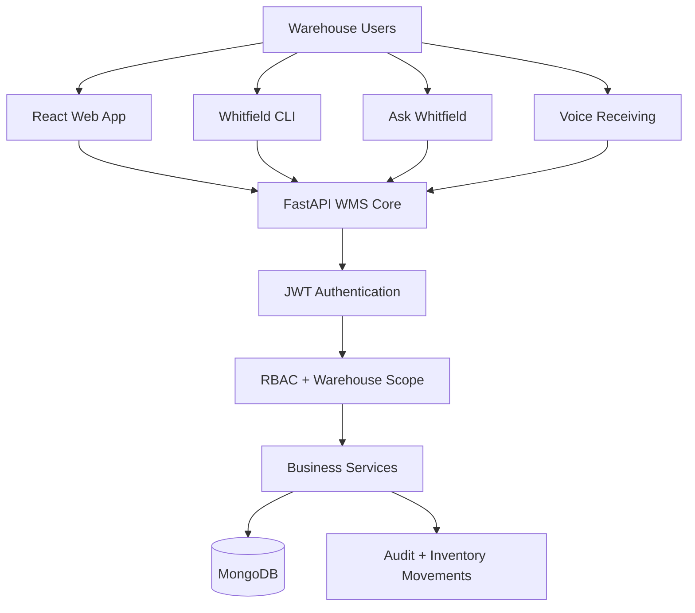
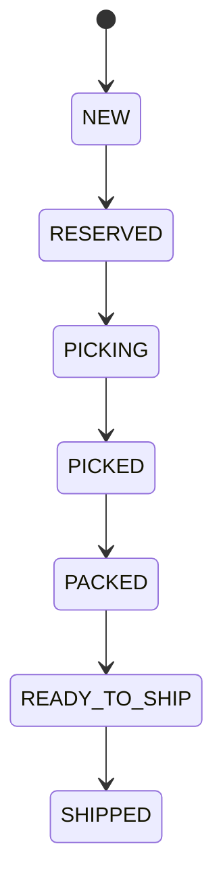
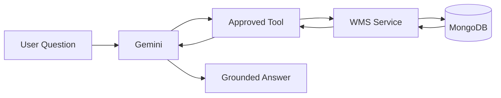
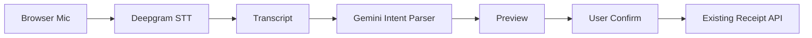

<div align="center">

# 🏭 Whitfield WMS

### Centralized, Real-Time Warehouse Management System for Multi-Warehouse Fulfillment

**Accurate inventory. Safe receiving. Concurrency-aware fulfillment. Role-based access. AI assistance. SOP RAG. CLI automation. Hands-free receiving.**

<br/>


<br/>


</div>

---

## 📌 Overview

**Whitfield WMS** is a full-stack Warehouse Management System designed for a multi-seller fulfillment operation running across two warehouses:

- **Reno, Nevada**
- **Columbus, Ohio**

The project replaces spreadsheet-driven warehouse workflows with a centralized system that maintains real-time inventory, prevents duplicate receiving, reduces overselling risk, enforces warehouse-level access control, preserves auditability, and gives warehouse staff multiple controlled interfaces to the same trusted operational core.

The system supports:

- 🌐 Web-based warehouse operations
- 📦 Inbound receiving
- 🛒 Outbound fulfillment
- 📊 Real-time inventory visibility
- 🔐 Role-based access control
- 🧾 Inventory movement + audit history
- 🤖 AI operational queries
- 📚 SOP-based RAG assistance
- 💻 Secure programmable CLI
- 🎙️ Hands-free inbound receiving voice input

> **Design principle:** Web, AI, CLI, and Voice are not separate warehouse systems. They are controlled interfaces over one trusted FastAPI WMS core.

---

# 🎯 Problem Statement

Whitfield Fulfillment previously relied heavily on spreadsheet-style warehouse workflows.

A simplified inbound process looked like:

```text
Tracking / Ticket
      ↓
Open Boxes
      ↓
Scan UPC
      ↓
Enter Quantity
      ↓
Enter Damaged Quantity
      ↓
Receive Stock
```

Outbound fulfillment followed:

```text
Order
  ↓
Reserve
  ↓
Pick
  ↓
Pack
  ↓
Create Shipment
  ↓
Ship
```

This created several operational risks:

- Duplicate stock after retries or repeated receiving actions
- Overselling under concurrent order reservations
- Weak traceability of inventory changes
- Excessive access to warehouse data/actions
- Repetitive warehouse questions requiring manual lookup
- Hands-busy staff repeatedly switching between physical work and keyboard entry
- Spreadsheet processes that do not scale cleanly
- Limited programmability for automation and operational tooling

### Final Problem Statement

> **Design a centralized, real-time Warehouse Management System for Whitfield Fulfillment that maintains accurate inventory across multiple sellers and two warehouse locations, prevents duplicate receiving and overselling under concurrent operations, provides complete auditability, enforces role-based access, and supports efficient warehouse operations through dashboards, AI assistance, voice interaction, and programmable automation.**

---

# ✅ Solution Summary

Whitfield WMS addresses the problem through one centralized backend.



### Core rule

```text
All operational interfaces
        ↓
FastAPI
        ↓
JWT
        ↓
RBAC
        ↓
Warehouse Scope
        ↓
Business Rules
        ↓
MongoDB
```

There is no trusted path like:

```text
AI → MongoDB
CLI → MongoDB
Voice → MongoDB
Frontend → MongoDB
```

---

# ✨ Major Features

| Area | Capability |
|---|---|
| 🏠 Dashboard | Warehouse-specific operational visibility |
| 📦 Receiving | Create receipt, scan UPC, record good/damaged quantities, complete safely |
| 🧮 Inventory | On-hand, reserved, available, damaged stock |
| 🛒 Orders | Multi-stage fulfillment lifecycle |
| 🚚 Shipping | Shipment creation and controlled shipping |
| 🔐 RBAC | Four explicit roles with warehouse-level scope |
| 🧾 Audit | Track sensitive actions and inventory-related history |
| 📉 Oversell Protection | Reservation checks prevent invalid stock promises |
| 🔁 Idempotency | Receipt completion and shipping are protected from duplicate application |
| 🤖 AI Assistant | Natural-language operational queries against approved read-only tools |
| 📚 RAG | SOP-grounded warehouse policy/procedure answers |
| 💻 CLI | Scriptable warehouse operations over FastAPI |
| 🎙️ Voice | Inbound quantity voice entry with preview + explicit confirmation |

---

# 👥 Role-Based Access Control

Whitfield WMS uses exactly four user roles:

| Role | Typical Responsibility |
|---|---|
| `OWNER` | Global oversight, users, audit, broad operational visibility |
| `MANAGER` | Warehouse operations and management within allowed scope |
| `RECEIVING_STAFF` | Inbound receiving and scoped inventory visibility |
| `FULFILLMENT_STAFF` | Order fulfillment and scoped inventory visibility |

### Warehouse scope

A user may be assigned access to:

- Reno
- Columbus
- or a broader set according to role and configuration

A frontend route or hidden button is **not** the security boundary.

The backend always remains authoritative.

Example:

```text
Receiving Staff
Warehouse Scope: Reno

Request:
Show Columbus inventory

Result:
403 Access Denied
```

---

# 📦 Inbound Receiving

## Workflow


### Important receiving protections

- UPC must map to a registered product
- Product must belong to the correct seller
- Good and damaged quantities are stored separately
- Completed receipts cannot be casually mutated
- Receipt completion applies inventory only once
- Retry does not create duplicate stock
- Warehouse scope is validated server-side
- Fulfillment staff cannot bypass receiving authorization

### Inventory application

If a receipt contains:

```text
Good:    2
Damaged: 1
```

then completion applies:

```text
on_hand  += 2
damaged  += 1
```

only once.

---

# 🛒 Outbound Fulfillment

## State Machine



### Inventory semantics

#### Reservation

```text
on_hand   unchanged
reserved  increases
available decreases
```

#### Shipping

```text
on_hand   decreases
reserved  decreases
```

### Key protections

- Cannot reserve more than available inventory
- Invalid state transitions are rejected
- Shipping is protected from duplicate stock decrement
- Warehouse authorization remains server-side

---

# 🧮 Inventory Model

Whitfield tracks four important quantities:

```text
on_hand
reserved
available
damaged
```

### Core invariant

```text
available = on_hand - reserved
```

Additional invariants:

```text
on_hand  >= 0
reserved >= 0
damaged  >= 0

reserved <= on_hand
```

The system separates damaged inventory from sellable stock.

---

# 🔁 Idempotency & Concurrency Safety

Two of the most important warehouse failures are duplicate receiving and overselling.

## Duplicate receipt protection

```text
Complete Receipt
      ↓
Stock Applied

Retry Complete
      ↓
No Second Increment
```

## Double shipping protection

```text
Ship Order
   ↓
Stock Decremented

Retry Ship
   ↓
No Second Decrement
```

## Oversell protection

If:

```text
available = 5
requested = 8
```

reservation is rejected instead of creating negative/invalid availability.

---

# 🧾 Auditability

Whitfield preserves operational traceability through:

- Audit logs
- Inventory movement history
- User identity
- Action/entity context
- Timestamps
- Warehouse context where applicable

The goal is simple:

> **Every inventory-affecting operation should be explainable.**

---

# 🤖 Ask Whitfield — Operational AI Assistant

Whitfield includes a read-only operational AI assistant.

Example:

> **How much Widget A is available in Reno?**

The assistant does not query MongoDB directly.

Instead:



### Approved operational tools

The assistant uses a small allowlist such as:

```text
get_inventory
lookup_product
list_receipts
list_orders
get_operational_summary
get_recent_activity
search_sop
```

There are no AI tools for:

```text
update_inventory
ship_order
complete_receipt
create_user
raw_database_query
read_arbitrary_file
```

---

# 📚 SOP RAG

Operational facts and warehouse procedures are intentionally separated.

### Live question

> How much Widget A is available?

```text
→ WMS live-data tool
```

### Procedure question

> What should I do with damaged items?

```text
→ search_sop
→ local RAG
→ approved Whitfield SOP
```

## RAG Stack

```text
Whitfield SOP Markdown
        ↓
Section-Aware Chunking
        ↓
all-MiniLM-L6-v2
        ↓
ChromaDB
        ↓
search_sop
        ↓
Gemini Grounded Response
```

The SOP corpus includes receiving, damaged goods, fulfillment, inventory adjustment, and warehouse-access guidance.

### No-source behavior

If asked:

> What is Whitfield's vacation policy?

the assistant does not invent an answer.

It responds that no approved Whitfield SOP covers the question.

---

# 💻 Whitfield CLI

Whitfield also exposes a secure command-line interface.

### Architecture

```text
CLI
 ↓
HTTPX
 ↓
FastAPI
 ↓
JWT / RBAC / Warehouse Scope
 ↓
Existing WMS Services
```

The CLI never connects directly to MongoDB.

## Example commands

```powershell
python -m whitfield_cli --help
```

```powershell
python -m whitfield_cli auth whoami
```

```powershell
python -m whitfield_cli products lookup --upc 194253397168
```

```powershell
python -m whitfield_cli inventory get --upc 194253397168 --warehouse Reno
```

```powershell
python -m whitfield_cli orders list --status READY_TO_SHIP --json
```

## Script-friendly JSON

```powershell
$result = python -m whitfield_cli inventory get `
  --upc 194253397168 `
  --warehouse Reno `
  --json | ConvertFrom-Json

$result.available
```

### CLI security

- No direct MongoDB access
- No arbitrary DB commands
- No local role override
- Backend authorization remains authoritative
- Predictable non-zero exit codes for failures
- High-impact actions use confirmation

---

# 🎙️ Inbound Voice Receiving

Whitfield includes a hands-free receiving MVP for warehouse workers.

### Example

Worker says:

> **“Three good, two damaged.”**

Flow:



Structured intent:

```json
{
  "intent": "RECEIVING_QUANTITY",
  "good_qty": 3,
  "damaged_qty": 2
}
```

### Critical voice safety rule

```text
Speech ≠ Transaction
Transcript ≠ Transaction
Gemini Intent ≠ Transaction
```

The worker sees a preview:

```text
Widget A
UPC: 194253397168

I heard:
"Three good, two damaged"

Good Units:    3
Damaged Units: 2

[Cancel]   [Confirm]
```

Only after **Confirm** does the frontend reuse the existing trusted receipt add-item API.

### Voice properties

- Explicit microphone activation
- Short recording only
- Deepgram key stays backend-side
- Gemini key stays backend-side
- No audio persistence
- Unsupported commands are blocked
- Manual receiving remains available if AI/STT fails

---

# 🛡️ Security Architecture

Security is enforced at multiple layers.

## Authentication

- JWT-based authentication
- Protected backend routes
- No public signup in the operational application

## Authorization

- Four fixed roles
- Warehouse-scoped access
- Backend enforcement for sensitive operations

## Inventory safety

- No arbitrary stock overwrite
- Controlled workflows only
- Duplicate completion protection
- Oversell protection
- Double-ship protection

## AI safety

- Read-only tool allowlist
- No raw database access
- No arbitrary filesystem access
- Model-provided role/scope is never trusted

## CLI safety

- HTTP → FastAPI only
- No ODM/PyMongo access
- No local role escalation

## Voice safety

- Interpretation is preview-only
- Confirmation mandatory
- Existing receipt API performs actual mutation

---

# 🧱 Technology Stack

## Frontend

- React
- TypeScript
- Vite
- TanStack Router / Query
- Tailwind CSS
- shadcn/ui / Radix primitives
- Lucide React
- Axios
- Zod
- React Hook Form
- Recharts
- Sonner

## Backend

- Python
- FastAPI
- Pydantic
- MongoDB
- ODMantic / PyMongo-based persistence
- JWT authentication
- HTTPX
- Typer CLI

## AI / RAG / Voice

- Google Gemini
- SentenceTransformers
- `all-MiniLM-L6-v2`
- ChromaDB
- Deepgram STT
- Browser `MediaRecorder`

---

# 🗂️ Project Structure

A simplified project structure:

```text
WMS/
├── backend/
│   ├── core/
│   │   ├── apis/
│   │   ├── controllers/
│   │   ├── models/
│   │   ├── services/
│   │   │   ├── ai/
│   │   │   │   └── rag/
│   │   │   └── voice/
│   │   └── ...
│   │
│   ├── data/
│   │   └── warehouse_sops/
│   │
│   ├── whitfield_cli/
│   ├── CLI.md
│   ├── requirements.txt
│   └── .env.example
│
├── frontend/
│   ├── src/
│   │   ├── components/
│   │   ├── features/
│   │   ├── lib/
│   │   └── ...
│   ├── package.json
│   └── ...
│
└── README.md
```

---

# ⚙️ Local Setup

## Prerequisites

Install:

- Python 3.11+
- Node.js 18+
- MongoDB / MongoDB Atlas
- Git

You will also need API credentials for optional AI/voice functionality:

- Google Gemini
- Deepgram

---

## 1. Clone the Repository

```bash
git clone <YOUR_GITHUB_REPOSITORY_URL>
cd WMS
```

---

## 2. Backend Setup

```powershell
cd backend
python -m venv .venv
.\.venv\Scripts\Activate.ps1
pip install -r requirements.txt
```

Create:

```text
backend/.env
```

Use the project's `.env.example` as the reference.

Typical configuration includes values such as:

```env
MONGO_URL=
MONGODB_DATABASE=

JWT_SECRET=

GEMINI_API_KEY=
DEEPGRAM_API_KEY=
```

> Never commit `.env` or real credentials.

Start FastAPI using the backend's configured application entry point.

Example:

```powershell
uvicorn core.main:app --reload
```

If your project uses a different module path, use the actual application entry point from the repository.

---

## 3. Frontend Setup

```powershell
cd frontend
npm install
npm run dev
```

Local frontend is typically available at:

```text
http://localhost:8080
```

depending on the Vite configuration.

---

# 🧪 Build Verification

Frontend production build:

```powershell
cd frontend
npm run build
```

CLI help:

```powershell
cd backend
.\.venv\Scripts\python.exe -m whitfield_cli --help
```

FastAPI OpenAPI can be checked at the configured backend:

```text
/openapi.json
```

---

# 🧪 Important Acceptance Scenarios

## Receiving idempotency

```text
Complete receipt
→ inventory updates

Retry completion
→ no second inventory increment
```

## Reservation

```text
Before:
on_hand = X
reserved = Y

Reserve Q

After:
on_hand = X
reserved = Y + Q
available decreases
```

## Oversell

```text
requested quantity > available
→ reservation denied
```

## Shipping

```text
Ship once
→ stock decremented

Retry shipping
→ no second decrement
```

## RBAC

```text
Reno Receiving Staff
→ Reno receipt access: PASS
→ Columbus inventory: DENIED
→ fulfillment mutation: DENIED
```

## AI

```text
"How much Widget A is available in Reno?"
→ live WMS tool
```

## RAG

```text
"What should I do with damaged items?"
→ Damaged Goods SOP
```

## Voice

```text
"Three good, two damaged"
→ preview
→ explicit confirmation
→ normal receipt add-item API
```

---

# 🧪 Demo Data Example

A common demo product used during development:

```text
Product: Widget A
UPC:     194253397168
Seller:  Acme Corp
```

Always rely on the current database rather than hard-coded inventory counts.

---

# 📸 Screenshots

Add your final screenshots under a folder such as:

```text
docs/screenshots/
```

Recommended screenshots:

```text
01-dashboard.png
02-receiving.png
03-inventory.png
04-orders.png
05-ai-assistant.png
06-rag-sources.png
07-cli.png
08-voice-preview.png
09-audit-log.png
```

Then enable this section:

<!--
## Dashboard


## Receiving


## Ask Whitfield


## Voice Receiving


-->

---

# 🎬 Suggested Demo Flow

A clean evaluator demo can follow this order:

```text
1. Login with role-scoped account
2. Show dashboard
3. Create / open inbound receipt
4. Scan Widget A UPC
5. Use voice: "Two good, one damaged"
6. Preview + confirm
7. Complete receipt
8. Show inventory update
9. Create / open fulfillment order
10. Reserve
11. Pick
12. Pack
13. Ship
14. Show inventory semantics
15. Demonstrate denied cross-warehouse action
16. Ask Whitfield live inventory question
17. Ask damaged-goods SOP question
18. Show CLI inventory query
19. Show audit trail
```

---

# 🧠 Engineering Principles Used

### 1. One trusted operational core

Every interface uses FastAPI.

### 2. Server-side authorization

UI visibility does not equal permission.

### 3. Idempotent warehouse mutations

Retries must not duplicate stock effects.

### 4. Separate physical stock from promise state

`on_hand`, `reserved`, and `available` are distinct.

### 5. AI does not become authority

LLMs interpret/query; WMS services enforce.

### 6. Voice requires human confirmation

Speech recognition errors never directly become warehouse transactions.

### 7. Failure should degrade safely

If Gemini or Deepgram is unavailable, core manual warehouse operations continue to work.

---

# 🚧 MVP Boundaries

Whitfield WMS is designed as a strong functional MVP rather than a production-complete enterprise WMS.

Not included in the current scope:

- Autonomous AI inventory mutation
- Outbound voice commands
- Continuous voice listening
- Twilio phone workflows
- Robotics
- RFID integration
- Accounting integration
- Returns management
- Forecasting
- Advanced carrier integrations
- Production-scale multi-region infrastructure

These were intentionally excluded to keep focus on the core warehouse problem.

---

# 🏁 Current Status

```text
Core WMS                    ✅ Complete
Authentication / RBAC       ✅ Complete
Receiving                   ✅ Complete
Inventory                   ✅ Complete
Fulfillment                 ✅ Complete
Auditability                ✅ Complete
AI Operational Assistant    ✅ Functional MVP
RAG / SOP Assistant         ✅ Complete
Secure CLI                  ✅ Complete
Inbound Voice               ✅ MVP
Demo Hardening              ✅ Manual polish completed
```

### Project status

> **Whitfield WMS is a feature-complete warehouse-management MVP covering the original problem statement across operational workflows, security, AI assistance, programmable automation, and inbound voice interaction.**

---

# 💡 Key Takeaway

Whitfield WMS is not simply a collection of features.

Its architecture is centered around one principle:

```text
                  ┌─────────────┐
                  │   Web UI    │
                  └──────┬──────┘
                         │
                  ┌──────▼──────┐
                  │     CLI     │
                  └──────┬──────┘
                         │
                  ┌──────▼──────┐
                  │ AI / RAG    │
                  └──────┬──────┘
                         │
                  ┌──────▼──────┐
                  │    Voice    │
                  └──────┬──────┘
                         │
                         ▼
              ┌──────────────────────┐
              │     FastAPI WMS      │
              └──────────┬───────────┘
                         │
                 JWT + RBAC + Scope
                         │
                         ▼
              ┌──────────────────────┐
              │   Business Rules     │
              └──────────┬───────────┘
                         │
                         ▼
                    ┌─────────┐
                    │ MongoDB │
                    └─────────┘
```

> **Build the warehouse core once. Expose it safely through multiple interfaces.**

---

<div align="center">

### 🏭 Whitfield Fulfillment WMS

**Real-time warehouse operations with security, traceability, intelligence, automation, and hands-free receiving.**

</div>
